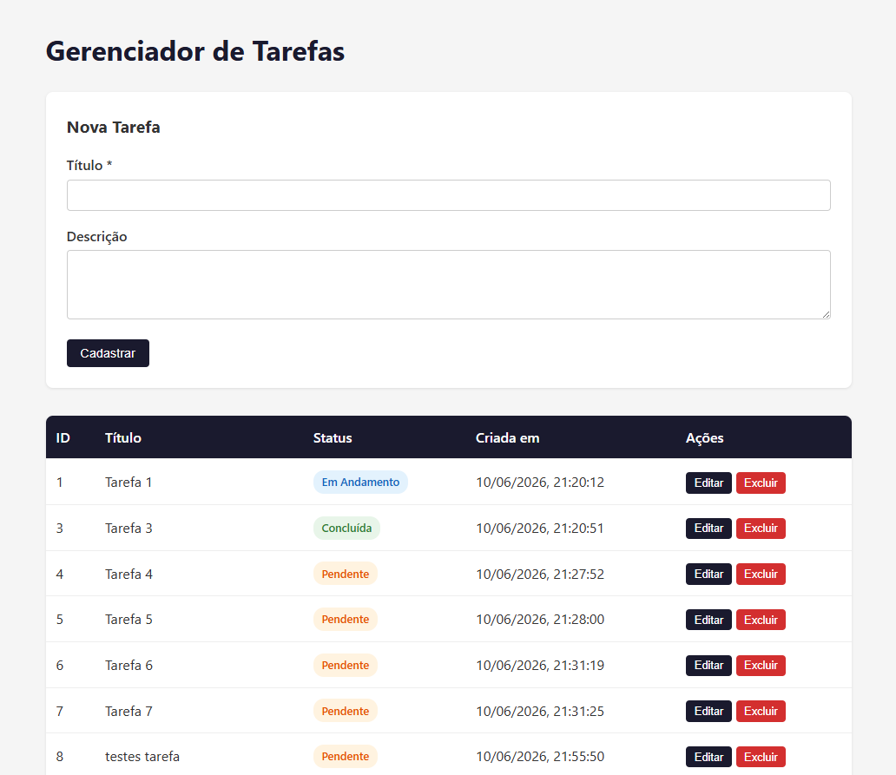
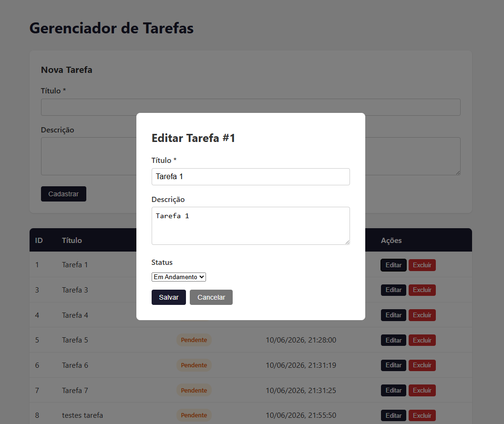
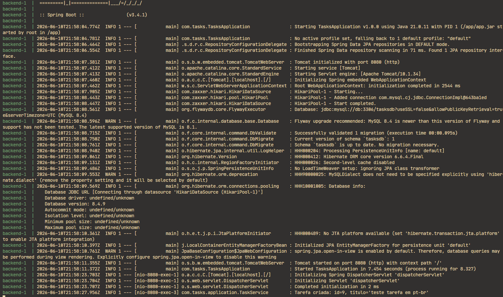

# Gerenciador de Tarefas

Aplicação full stack para gerenciamento de tarefas com CRUD completo, desenvolvida como parte de um desafio técnico.

O desafio consistiu em:
- Implementar um recurso ponta a ponta (front-end → API → banco de dados → logs)
- Analisar um incidente com base em logs e sugerir correções e prevenção
- Entregar testes, documentação de API e notas técnicas

---

## Stack

| Camada     | Tecnologia                                    |
|------------|-----------------------------------------------|
| Backend    | Java 21, Spring Boot 3.4, Spring Data JPA     |
| Banco      | MySQL 8                                       |
| Migração   | Flyway                                        |
| Frontend   | React 18, Vite 5, React Router 6, Axios       |
| Infra      | Docker, Docker Compose                        |
| Testes     | JUnit 5, Mockito, Spring MockMvc, H2 (testes) |

---

## Arquitetura

### Backend (Java / Spring Boot)

Arquitetura em camadas com separação clara de responsabilidades:

```
com.tasks
├── domain/          → Entidade JPA (Task), enum (TaskStatus), repositório
├── application/     → Serviço com regras de negócio e logging (TaskService)
└── api/             → Controller REST, DTOs (request/response), exception handler
```

- **domain**: Define o modelo de dados e a interface de persistência.
- **application**: Contém a lógica de negócio e produz logs estruturados em todas as operações.
- **api**: Expõe os endpoints REST, valida entradas com Bean Validation e trata erros de forma consistente via `@RestControllerAdvice`.

### Frontend (React / Vite)

Componentes funcionais com estado centralizado no componente raiz (`App.jsx`):

```
src/
├── App.jsx               → Estado global (tasks, editingTask, apiError)
├── components/
│   ├── TaskForm.jsx      → Formulário de criação com validação client-side
│   ├── TaskList.jsx      → Tabela com badges de status e ações
│   └── TaskEditModal.jsx → Modal de edição com dropdown de status
└── services/
    └── taskService.js    → Cliente Axios para a API
```

### Fluxo de dados

```
[React UI] → Axios → /api/tasks → TaskController → TaskService → TaskRepository → [MySQL]
                ↕                              ↕
           Validação client-side          Logs SLF4J (INFO/WARN/ERROR)
```

---

## Estrutura do Projeto

```
desafio-java-react/
├── docker-compose.yml          # Orquestração dos serviços
├── backend/
│   ├── Dockerfile
│   ├── pom.xml
│   └── src/
│       ├── main/java/com/tasks/
│       │   ├── TasksApplication.java
│       │   ├── domain/{Task.java, TaskStatus.java, TaskRepository.java}
│       │   ├── application/{TaskService.java, TaskNotFoundException.java}
│       │   └── api/{TaskController.java, TaskRequest.java, TaskUpdateRequest.java, TaskResponse.java, exception/}
│       ├── main/resources/
│       │   ├── application.properties
│       │   └── db/migration/V1__create_tasks_table.sql
│       └── test/
│           ├── java/com/tasks/{TasksApplicationTests.java, api/TaskControllerTest.java, application/TaskServiceTest.java}
│           └── resources/application-test.properties
├── frontend/
│   ├── Dockerfile
│   ├── package.json
│   ├── vite.config.js
│   └── src/
│       ├── main.jsx
│       ├── App.jsx / App.css
│       ├── components/{TaskForm.jsx, TaskList.jsx, TaskEditModal.jsx}
│       └── services/taskService.js
└── docs/
    ├── ENDPOINTS.md            # Documentação detalhada da API
    ├── TECHNICAL_NOTES.md      # Decisões técnicas, trade-offs e melhorias futuras
    └── INCIDENT_ANALYSIS.md    # Análise de incidente (NPE ao criar tarefa sem título)
```

---

## Execução

### Com Docker (recomendado)

```bash
docker compose up --build
```

Acessar:
- **Frontend:** http://localhost:5173
- **API:** http://localhost:8080/api/tasks

### Manual (sem Docker)

**Backend:**

```bash
cd backend
# Configure application.properties com seu MySQL local
mvn spring-boot:run
```

**Frontend:**

```bash
cd frontend
npm install
npm run dev
```

> No modo manual, ajuste o proxy em `vite.config.js` para apontar para `http://localhost:8080`.

---

## Evidências

### Tela principal — Listagem de tarefas



### Modal de edição



### Logs da aplicação



---

## Endpoints da API

| Método   | Rota               | Descrição             | Códigos de resposta              |
|----------|---------------------|-----------------------|----------------------------------|
| `POST`   | `/api/tasks`        | Criar tarefa          | 201, 400                         |
| `GET`    | `/api/tasks`        | Listar todas          | 200                              |
| `GET`    | `/api/tasks/{id}`   | Buscar por ID         | 200, 404                         |
| `PUT`    | `/api/tasks/{id}`   | Atualizar tarefa      | 200, 400, 404                    |
| `DELETE` | `/api/tasks/{id}`   | Remover tarefa        | 204, 404                         |

Todas as respostas de erro seguem o formato:

```json
{ "timestamp": "2026-06-10T10:00:00", "status": 400, "message": "title: Title must be between 3 and 100 characters" }
```

Documentação completa em [`docs/ENDPOINTS.md`](docs/ENDPOINTS.md).

---

## Modelo de Dados

**Tabela `tasks`:**

| Coluna      | Tipo         | Restrições                    |
|-------------|--------------|-------------------------------|
| id          | BIGINT       | AUTO_INCREMENT, PK            |
| title       | VARCHAR(100) | NOT NULL                      |
| description | VARCHAR(500) | nullable                      |
| status      | VARCHAR(20)  | NOT NULL (PENDING/IN_PROGRESS/DONE) |
| created_at  | DATETIME     | NOT NULL, DEFAULT CURRENT_TIMESTAMP |

O schema é gerenciado via Flyway (`V1__create_tasks_table.sql`). O Hibernate opera com `ddl-auto=validate` para garantir que o código esteja alinhado com o banco.

---

## Testes

**9 testes** distribuídos em 3 classes, todos validados com H2 em memória e perfil `test`.

```bash
cd backend && mvn test
```

| Classe                    | Escopo         | Qtd  | O que cobre                              |
|---------------------------|----------------|------|------------------------------------------|
| `TasksApplicationTests`   | Integração     | 1    | Contexto da aplicação sobe corretamente  |
| `TaskServiceTest`         | Unitário       | 5    | CRUD do service com mock do repositório  |
| `TaskControllerTest`      | Controller     | 3    | HTTP 201, 200, 400 com validação         |

---

## Logging

Operações da entidade `Task` produzem logs estruturados via SLF4J:

| Nível | Ocorrência                                 |
|-------|--------------------------------------------|
| INFO  | Criação, atualização e remoção de tarefas  |
| WARN  | Tarefa não encontrada, erro de validação   |
| ERROR | Exceções inesperadas (com stack trace)     |
| DEBUG | Listagem de tarefas                        |

---

## Documentação Complementar

| Arquivo                                            | Conteúdo                                         |
|----------------------------------------------------|--------------------------------------------------|
| [`docs/ENDPOINTS.md`](docs/ENDPOINTS.md)           | Documentação completa da API com exemplos        |
| [`docs/TECHNICAL_NOTES.md`](docs/TECHNICAL_NOTES.md) | Decisões técnicas, trade-offs e melhorias futuras |
| [`docs/INCIDENT_ANALYSIS.md`](docs/INCIDENT_ANALYSIS.md) | Análise de incidente: causa, correção e prevenção |

---

## Requisitos do Desafio Atendidos

- **CRUD ponta a ponta**: Frontend (React) → API (Spring Boot) → Banco (MySQL) com logs em todas as operações.
- **API documentada**: Endpoints com exemplos de request/response e códigos de erro.
- **Frontend funcional**: CRUD completo, validações client-side, modal de edição, badges de status.
- **Testes**: 9 testes entre unitários e de integração cobrindo service, controller e contexto da aplicação.
- **Análise de incidente**: Documentada em [`docs/INCIDENT_ANALYSIS.md`](docs/INCIDENT_ANALYSIS.md), com causa raiz, correção e prevenção.
- **Notas técnicas**: Decisões, trade-offs e melhorias futuras em [`docs/TECHNICAL_NOTES.md`](docs/TECHNICAL_NOTES.md).
- **Boas práticas**: Arquitetura em camadas, validação de entrada, tratamento global de erros, migrações versionadas, logs estruturados.
